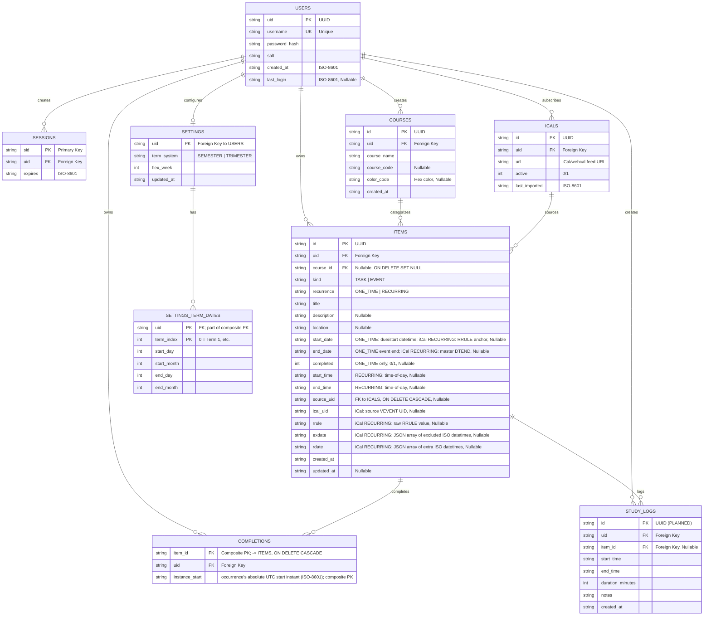

# University Planner App - Database Schema (ERD)

Reflects the schema created at runtime by [backend/db/connection.ts](backend/db/connection.ts).
All primary keys are TEXT UUIDs, timestamps/dates are TEXT (ISO-8601 strings), and booleans
(`completed`) are INTEGER `0`/`1`. There are no migrations — connect only creates missing
tables; delete the DB file to rebuild.

## Entity Relationship Diagram

## Tables

- **USERS** — authentication and profile.
- **SESSIONS** — active user sessions.
- **ITEMS** — every task and event, one-time or recurring, in one table. `kind`
  (`TASK`/`EVENT`) and `recurrence` (`ONE_TIME`/`RECURRING`) discriminate the row:
  - `ONE_TIME` rows use `start_date`/`end_date` (absolute datetimes) and `completed`.
  - `RECURRING` rows are described by an iCal `rrule` (+ `exdate`/`rdate`), anchored by
    `start_date`/`start_time`. App-native weekly recurrence is stored the same way — just
    `FREQ=WEEKLY;BYDAY=...` Both expand into concrete occurrences on the fly; per-occurrence
    completion lives in COMPLETIONS.
  - An `EVENT` carries an end (`end_date`); a `TASK` leaves it NULL.
  - `source_uid` is a FK to `ICALS.id` — which subscription an imported row came from; NULL
    for hand-created rows. `ical_uid` is the source VEVENT's own UID (stable identity for re-imports).
- **ICALS** — saved iCal/webcal calendar subscriptions (one row per feed a user has added).
  Deleting a subscription cascade-deletes the items imported from it.
- **COMPLETIONS** — per-occurrence completion for recurring items, keyed by the occurrence's
  absolute UTC start instant. A row exists only for a completed occurrence;
  `PRIMARY KEY (item_id, instance_start)` prevents duplicates. (ONE_TIME items use
  `items.completed` instead.)
- **COURSES** — course/subject categorization with color coding.
- **SETTINGS** / **SETTINGS_TERM_DATES** — per-user term system, flex week, and each term's
  start/end (day + month).
- **STUDY_LOGS** _(planned, Phase 3B — not yet implemented)_ — study-session time tracking.

## Design Notes

- **User isolation**: every table carries `uid`, so users see only their own data.
- **Cascading deletes**: foreign keys use `ON DELETE CASCADE` (`ON DELETE SET NULL` for
  `items.course_id`); `PRAGMA foreign_keys = ON` is set on connection. Deleting a user or an item
  removes its dependent rows (sessions, items, completions).
- **Recurrence**: stored as a single iCal RRULE in `rrule`. App-native weekly patterns are
  `FREQ=WEEKLY;BYDAY=MO,WE,FR` (bounded by `UNTIL` when the item has an end date); the CRUD
  layer converts to/from the API's weekday list. iCal imports store the feed's own RRULE.
- **iCal import**: a timetable iCal/`webcal` subscription is saved as a row in `icals` (`url`,
  `active`, `last_imported`). On import each `VEVENT` is stored faithfully as **one** `EVENT` row
  with `source_uid` set to the subscription's `icals.id` and `ical_uid` set to the VEVENT's UID:
  a recurring VEVENT keeps its raw `rrule` (+ `exdate`/`rdate`) rather than being expanded, so
  term breaks, intervals, and bounds survive. Re-imports match on `(source_uid, ical_uid)` and
  refresh the existing row in place (a moved room or renamed class) instead of duplicating it.
  `source_uid`/`ical_uid` are `NULL` for hand-created rows.
  _(Read-time expansion of the stored rule into dated occurrences is a follow-up.)_
