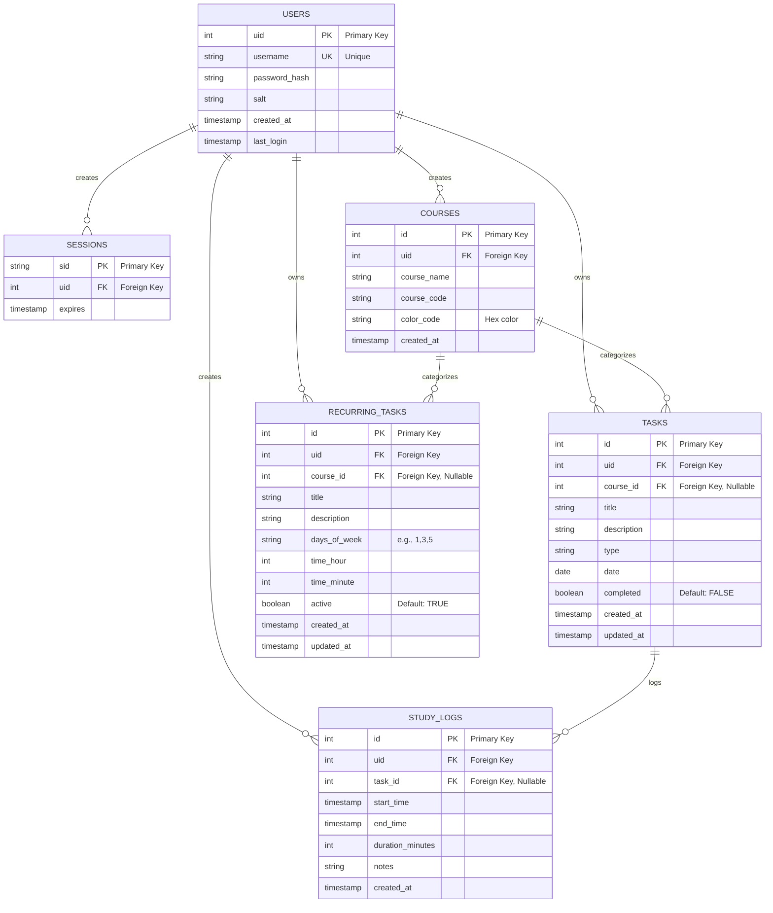

# University Planner App - Database Schema (ERD)

## Entity Relationship Diagram

## Schema Overview

### Core Tables (Phase 1)

- **USERS**: User authentication and profile
- **SESSIONS**: Active user sessions
- **TASKS**: Individual tasks with due dates
- **RECURRING_TASKS**: Repeating tasks (lectures, assignments, etc.)

### Student Features (Phase 3)

- **COURSES**: Course/subject categorization
- **STUDY_LOGS**: Time tracking for study sessions

## Key Relationships

| Relationship              | Description                                        |
| ------------------------- | -------------------------------------------------- |
| USERS → SESSIONS          | One user can have multiple active sessions         |
| USERS → TASKS             | One user owns multiple tasks                       |
| USERS → RECURRING_TASKS   | One user owns multiple recurring tasks             |
| USERS → COURSES           | One user can create multiple courses               |
| USERS → STUDY_LOGS        | One user can have multiple study logs              |
| COURSES → TASKS           | One course can categorize multiple tasks           |
| COURSES → RECURRING_TASKS | One course can categorize multiple recurring tasks |
| TASKS → STUDY_LOGS        | One task can have multiple study logs              |

## Design Notes

- **User Isolation**: All tables reference `uid` to ensure users see only their own data
- **Soft Relationships**: `course_id` is nullable to allow tasks without course assignment
- **Timestamps**: All tables track creation/update times for auditing
- **Indexes**: Performance indexes on frequently queried columns (uid, date, task_id, active)
- **Cascading Deletes**: Foreign keys use CASCADE to maintain referential integrity when users are deleted
