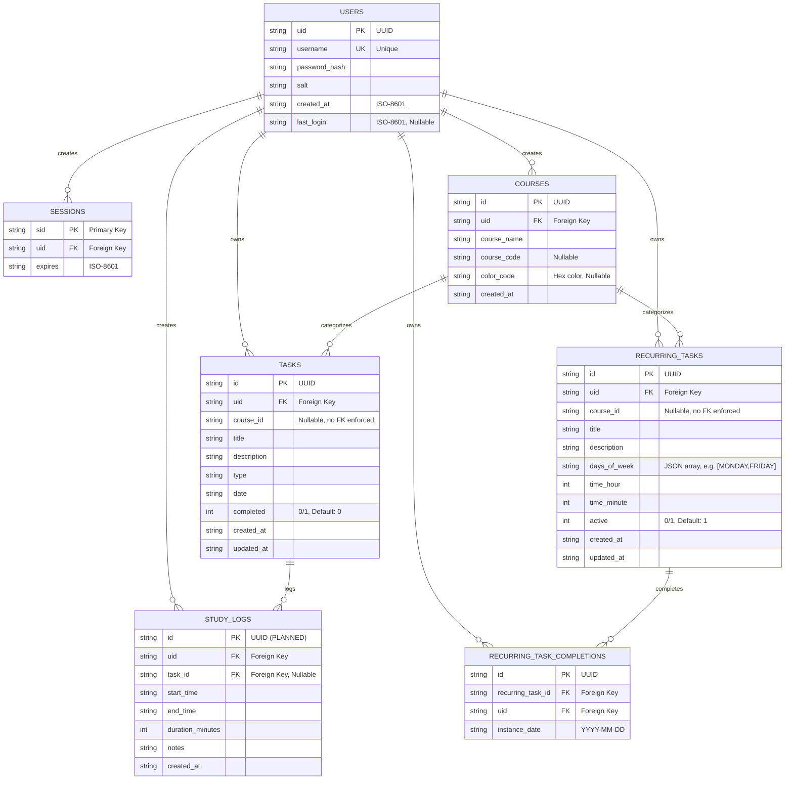

# University Planner App - Database Schema (ERD)

This diagram reflects the schema as actually created/managed at runtime by
[backend/dbManager.ts](backend/dbManager.ts). All primary keys are TEXT UUIDs,
timestamps/dates are TEXT (ISO-8601 strings), and booleans (`completed`,
`active`) are stored as INTEGER `0`/`1`.

## Entity Relationship Diagram

## Schema Overview

### Core Tables (Phase 1)

- **USERS**: User authentication and profile
- **SESSIONS**: Active user sessions
- **TASKS**: Individual one-time tasks with due dates
- **RECURRING_TASKS**: Repeating tasks (lectures, weekly assignments, etc.)
- **RECURRING_TASK_COMPLETIONS**: Per-occurrence completion tracking for recurring tasks

### Student Features (Phase 3)

- **COURSES**: Course/subject categorization with color coding
- **STUDY_LOGS** _(planned, Phase 3B — not yet implemented)_: Time tracking for study sessions

## Key Relationships

| Relationship                            | Description                                                  |
| --------------------------------------- | ------------------------------------------------------------ |
| USERS → SESSIONS                        | One user can have multiple active sessions                   |
| USERS → TASKS                           | One user owns multiple tasks                                 |
| USERS → RECURRING_TASKS                 | One user owns multiple recurring tasks                       |
| USERS → COURSES                         | One user can create multiple courses                         |
| USERS → RECURRING_TASK_COMPLETIONS      | One user owns multiple recurring-task completion records     |
| COURSES → TASKS                         | One course can categorize multiple tasks                     |
| COURSES → RECURRING_TASKS               | One course can categorize multiple recurring tasks           |
| RECURRING_TASKS → RECURRING_TASK_COMPLETIONS | One recurring task can have many completed occurrences  |
| TASKS → STUDY_LOGS _(planned)_          | One task can have multiple study logs                        |

## Design Notes

- **Identifiers**: All primary keys are TEXT UUIDs (`crypto.randomUUID()`); timestamps/dates are TEXT ISO-8601 strings; booleans are INTEGER `0`/`1`.
- **User Isolation**: All tables reference `uid` so users see only their own data.
- **Course Association**: `course_id` on `tasks` / `recurring_tasks` is nullable, allowing tasks without a course. It is added by an `ALTER TABLE` migration in `dbManager.ts` for existing databases and is **not** backed by an enforced foreign-key constraint.
- **Recurring Completions**: A row in `recurring_task_completions` exists only for completed occurrences; `UNIQUE(recurring_task_id, instance_date)` prevents duplicates. Recurring instances are expanded on-the-fly (4-week window) at display time.
- **Days of Week**: Stored as a JSON array of day names (e.g. `["MONDAY","WEDNESDAY","FRIDAY"]`).
- **Cascading Deletes**: Enforced foreign keys use `ON DELETE CASCADE` to maintain referential integrity when users or recurring tasks are deleted. `PRAGMA foreign_keys = ON` is set on connection.
- **Study Logs**: Documented as the intended Phase 3B design but not yet created by `dbManager.ts`.
