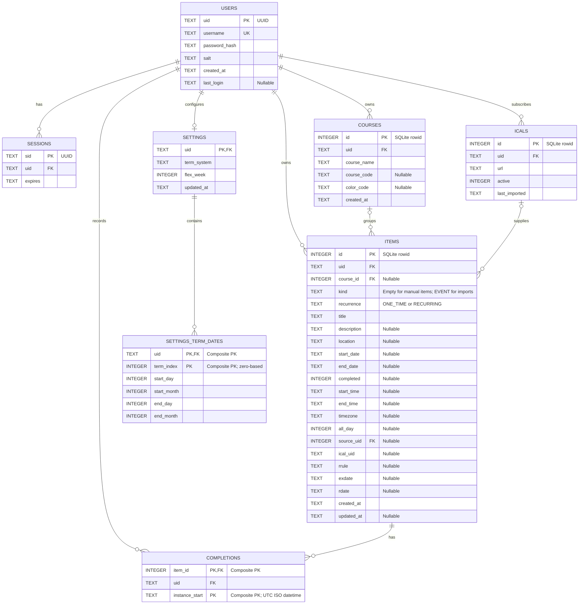

# Database schema

This document describes the eight tables created by [backend/db/connection.ts](backend/db/connection.ts) for a fresh database. [database_schema.sql](database_schema.sql) contains the matching standalone DDL. The default database is `data/app.db`, relative to the process working directory; the connection enables foreign keys and WAL journaling.

The application creates its schema directly in TypeScript. The SQL file is a reference/bootstrap schema, not a migration script. Startup also contains limited compatibility steps for older item columns and completion keys; it is not a versioned migration framework.

## Relationships

```mermaid
erDiagram
    USERS ||--o{ SESSIONS : has
    USERS ||--o{ COURSES : owns
    USERS ||--o{ ICALS : subscribes
    USERS ||--o{ ITEMS : owns
    USERS ||--o{ COMPLETIONS : records
    USERS ||--o| SETTINGS : configures
    COURSES |o--o{ ITEMS : groups
    ICALS |o--o{ ITEMS : supplies
    ITEMS ||--o{ COMPLETIONS : has
    SETTINGS ||--o{ SETTINGS_TERM_DATES : contains

    USERS {
        TEXT uid PK "UUID"
        TEXT username UK
        TEXT password_hash
        TEXT salt
        TEXT created_at
        TEXT last_login "Nullable"
    }
    SESSIONS {
        TEXT sid PK "UUID"
        TEXT uid FK
        TEXT expires
    }
    COURSES {
        INTEGER id PK "SQLite rowid"
        TEXT uid FK
        TEXT course_name
        TEXT course_code "Nullable"
        TEXT color_code "Nullable"
        TEXT created_at
    }
    ICALS {
        INTEGER id PK "SQLite rowid"
        TEXT uid FK
        TEXT url
        INTEGER active
        TEXT last_imported
    }
    ITEMS {
        INTEGER id PK "SQLite rowid"
        TEXT uid FK
        INTEGER course_id FK "Nullable"
        TEXT kind "Empty for manual items; EVENT for imports"
        TEXT recurrence "ONE_TIME or RECURRING"
        TEXT title
        TEXT description "Nullable"
        TEXT location "Nullable"
        TEXT start_date "Nullable"
        TEXT end_date "Nullable"
        INTEGER completed "Nullable"
        TEXT start_time "Nullable"
        TEXT end_time "Nullable"
        TEXT timezone "Nullable"
        INTEGER all_day "Nullable"
        INTEGER source_uid FK "Nullable"
        TEXT ical_uid "Nullable"
        TEXT rrule "Nullable"
        TEXT exdate "Nullable"
        TEXT rdate "Nullable"
        TEXT created_at
        TEXT updated_at "Nullable"
    }
    COMPLETIONS {
        INTEGER item_id PK, FK "Composite PK"
        TEXT uid FK
        TEXT instance_start PK "Composite PK; UTC ISO datetime"
    }
    SETTINGS {
        TEXT uid PK, FK
        TEXT term_system
        INTEGER flex_week
        TEXT updated_at
    }
    SETTINGS_TERM_DATES {
        TEXT uid PK, FK "Composite PK"
        INTEGER term_index PK "Composite PK; zero-based"
        INTEGER start_day
        INTEGER start_month
        INTEGER end_day
        INTEGER end_month
    }
```

`course_id` and `source_uid` are optional: an item may have no course, and manual items have no subscription. There is no `study_logs` table or separate task/event table.

## Keys, types, and constraints

- User IDs (`users.uid`) and session IDs (`sessions.sid`) are TEXT UUIDs generated by the application. Other `uid` columns refer to the owning user, directly or through settings.
- Course, subscription, and item IDs are `INTEGER PRIMARY KEY` rowid aliases assigned by SQLite. The schema does not use `AUTOINCREMENT`.
- Timestamps and absolute datetimes use ISO-8601 TEXT. Recurring wall-clock times use `HH:mm:ss`, and `timezone` records an IANA zone. A missing zone is treated as floating/UTC by the occurrence layer.
- `completed`, `active`, and `all_day` use integer flag conventions. Enum values, flag ranges, dates, JSON structure, and cross-user ownership are not enforced by SQL `CHECK` constraints.
- `users.username` is unique. Composite primary keys enforce one completion per `(item_id, instance_start)` and one term period per `(uid, term_index)`.
- The runtime creates no explicit performance indexes or triggers. SQLite creates indexes implied by primary-key and unique constraints.
- Subscription URLs and `(source_uid, ical_uid)` pairs do not have SQL uniqueness constraints; duplicate handling occurs in the import service.

## Table semantics

### Users and sessions

`users` stores a lowercased username, PBKDF2 password hash, salt, creation timestamp, and optional last-login timestamp. `sessions` stores a session UUID, owner, and expiration timestamp. Login creates a session valid for 24 hours; logout deletes it. Expired sessions are rejected and removed when validated.

### Courses

`courses` stores a required `course_name`, optional `course_code` and `color_code`, owner, and creation timestamp. The frontend calls courses **groups**. Deleting a course clears `items.course_id` while retaining the items.

### Calendar subscriptions (`icals`)

`icals` stores the feed URL, owner, active flag, and `last_imported`. The timestamp is set when the subscription is created and updated on successful import; creating a subscription row alone does not fetch events.

The active flag is currently stored metadata: item queries and manual refresh do not enforce it. There is no automatic background refresh. Deleting a subscription cascades to its imported items and their completion records.

### Items

`items` holds manual and imported planner entries. `recurrence` is the operative discriminator (`ONE_TIME` or `RECURRING`). Although the schema retains `kind`, current manual writes use an empty string and imports use `EVENT`; the current editor does not offer a separate TASK/EVENT mode.

| Column(s) | Current storage behavior |
| --- | --- |
| `id`, `uid` | Numeric item identity and user ownership. |
| `course_id` | Optional reference to a course belonging to the user, checked by the API. |
| `title`, `description`, `location` | Required title and optional notes/location. |
| `start_date` | One-time start instant or recurring anchor, stored as an ISO datetime. |
| `end_date` | One-time end instant; manual recurring series cutoff; imported recurring master occurrence's DTEND. These are different meanings. |
| `completed` | One-time completion (`0`/`1`); recurring items normally store NULL and use `completions`. |
| `start_time`, `end_time` | Recurring wall-clock times. Imports also populate these on one-time rows; manual one-time items leave them NULL. |
| `timezone` | IANA zone used when interpreting recurring wall-clock times. |
| `all_day` | `1` for imported date-only events; NULL/0 otherwise. |
| `source_uid` | Optional subscription ID referencing `icals.id`; despite the name, this is an INTEGER. |
| `ical_uid` | Source VEVENT UID used to match an event within its subscription. NULL for manual items. |
| `rrule` | Weekly RRULE generated from a manual weekday selection, or the imported feed's rule. NULL for one-time items. |
| `exdate`, `rdate` | Optional JSON arrays of excluded or additional ISO datetimes from imported feeds. |
| `created_at`, `updated_at` | Required creation timestamp and optional latest update timestamp. |

The database permits NULL date/time columns even where the application requires values. Manual one-time creation requires both start and end; manual recurring creation requires an anchor, weekday selection, and start/end wall-clock times.

Recurring instances are expanded at read time; they are not additional `items` rows. The occurrence API selects starts in `[from, to)` and returns them sorted by start. Zone-aware expansion maintains the series' wall-clock time across DST. Manual series cutoffs become RRULE `UNTIL` bounds; an imported master `end_date` must not be interpreted as a series cutoff. All-day feed dates are stored at UTC midnight with the `all_day` flag.

### Completions

For a recurring item, a row means the occurrence is complete; absence means incomplete. `instance_start` is the occurrence's absolute UTC ISO start, matching the occurrence API's `start`. The service validates that the requested instant is a real occurrence before adding or removing a completion. One-time completion lives in `items.completed` instead.

### Settings and term dates

`settings` has at most one row per user: `term_system`, `flex_week`, and `updated_at`. `settings_term_dates` stores each term's start/end as year-independent day/month pairs. `term_index` is zero-based; zero day/month values denote unset dates.

The settings service normalizes to two periods for `SEMESTER` or three for `TRIMESTER`. Saving settings upserts the parent and replaces its term-date rows in a single transaction. An unsaved user receives API defaults (semester, flex week 6, and two unset periods) without creating database rows.

## Import and ownership behavior

One imported VEVENT series produces one item, retaining its RRULE and exceptions when recurring. Re-import matches a feed's `ical_uid` within the owning user's subscription and updates the existing row. Course selections are checked against the authenticated user. Subscription, course, and item writes are transactional.

An item with a non-NULL `source_uid` is read-only through normal item updates (HTTP 409). Feed synchronization may update its details and schedule; users may still complete or delete it. Refresh preserves completion when recurrence type is unchanged. A switch between one-time and recurring clears incompatible completion state. Deleting an imported item does not add a permanent exclusion, so a later refresh can recreate it.

Refresh does not delete stored events that disappear from a feed. Per-occurrence overrides (`RECURRENCE-ID`) are not applied. EXDATE matching currently excludes whole local days; RDATE expansion uses the series' wall-clock start time.

User isolation is implemented by API ownership checks and queries scoped to `uid`. Foreign keys validate the referenced row's existence but do not independently require matching owners across tables.

## Delete actions

| Deleted row | Database effect |
| --- | --- |
| User | Cascade to sessions, courses, subscriptions, items, completions, and settings; settings deletion also removes term dates. |
| Course | Set referencing items' `course_id` to NULL. |
| Subscription | Cascade to imported items, then their completions. |
| Item | Cascade to its recurring completion rows. |
| Settings | Cascade to its term-date rows. |

These actions depend on `PRAGMA foreign_keys = ON`, which the application and standalone schema both enable.
